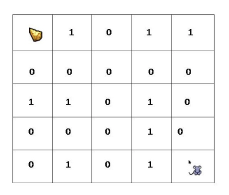

# Graph Depth Search

Apply the depth first search algorithm to see if the mouse can reach the cheese. Read the 5x5 matrix from a file
and create an identity label for each block.



Create graph_table.txt from the picture. Mouse is index 1, cheese is index 25. Map the mouse to the cheese 
outlining all possible paths denoted by the zeros.

```
0  1   1  2   0  6
1  2   0  1   0  3   1  7
0  3   1  2   1  4   0  8
1  4   0  3   0  5   0  9
0  5   1  4   0  10
0  6   0  1   1  7   0  11
1  7   1  2   0  6   0  8   1  12
0  8   0  3   1  7   0  9   0  13
0  9   1  4   0  8   0  10  1  14
0  10  0  5   0  9   1  15
0  11  0  6   1  12  0  16
1  12  1  7   0  11  0  13  0  17
0  13  0  8   1  12  1  14  0  18
1  14  0  9   0  13  1  15  0  19
1  15  0  10  1  14  0  20
0  16  0  11  0  17  1  21
0  17  1  12  0  16  0  18  1  22
0  18  0  13  0  17  0  19  0  23
0  19  1  14  0  18  0  20  1  24
0  20  1  15  0  19  0  25
1  21  0  16  1  22
1  22  0  17  1  21  0  23
0  23  0  18  1  22  1  24
1  24  0  19  0  23  0  25
0  25  0  20  1  24
```

[Graph table](graph_table_mouse.pdf)

### How to run.
```shell
$ g++ graph_mouse_main.cc -o graph_mouse_main
```
```shell
$ ./graph_mouse_main
```

### Output
```
1 -> 6
---------------------------
3 -> 8
---------------------------
5 -> 10
---------------------------
6 -> 1 -> 11
---------------------------
8 -> 3 -> 9 -> 13
---------------------------
9 -> 8 -> 10
---------------------------
10 -> 5 -> 9
---------------------------
11 -> 6 -> 16
---------------------------
13 -> 8 -> 18
---------------------------
16 -> 11 -> 17
---------------------------
17 -> 16 -> 18
---------------------------
18 -> 13 -> 17 -> 19 -> 23
---------------------------
19 -> 18 -> 20
---------------------------
20 -> 19 -> 25
---------------------------
23 -> 18
---------------------------
25 -> 20

Depth First Search:
1 -> 6 -> 11 -> 16 -> 17 -> 18 -> 13 -> 8 -> 3 -> 9 -> 10 -> 5 -> 19 -> 20 -> 25 -> 

The mouse can reach the cheese from node 1 to node 25.
```
